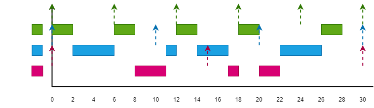
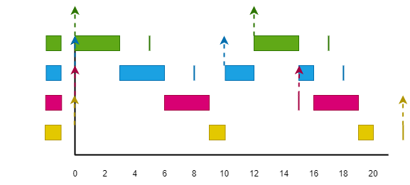
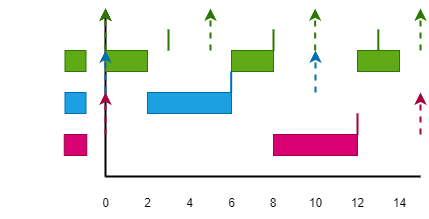

### **EJERCICIO 1**

***Dado el siguiente conjunto de procedimientos:***
| | Ci | Ti=Di |
| :-: | :-: | :-: |
| P1 | 2 | 10 |
| P2 | 4 | 15 |
| P3 | 10 | 30 |

***a\) Representa gráficamente un ejecutivo cíclico que planifique la ejecución secuencial de este conjunto de procedimientos.***

ciclo_mayor => MCM(10,15,30) = 30 \
ciclo_menor => MCD(10,15,30) = 5 \
numero_ciclos_menores => ciclo_mayor / ciclo_menor = 30 / 5 = 6


***b\) Implementa en Ada el bucle de control correspondiente al ejecutivo cíclico diseñado en el apartado anterior.***

``` ada
i_ciclo_menor := 0;
siguiente := Clock;
loop
    case i_ciclo_menor MOD 6 is
        when 0 => P1; P3(0..3);
        when 1 => P2;
        when 2 => P1; P3(3..5);
        when 3 => P2;
        when 4 => p1;
        when 5 => p3;
    end case;

    i_ciclo_menor := i_ciclo_menor+1;
    siguiente := siguiente + 25.0;
    delay until siguiente;
end loop;
```

---

### **EJERCICIO 2**

***Dado el siguiente conjunto de procedimientos:***
| | Ci | Ti=Di |
| :-: | :-: | :-: |
| P1 | 1 | 4 |
| P2 | 2 | 8 |
| P3 | 11 | 20 |

***a\) Justifica por qué no es posible construir un ejecutivo cíclico que planifique la ejecución secuencial de estos procedimientos  periódicos sin que ninguno de ellos pierda su plazo de ejecución.***

El uso de ejecución puede calcularse como:
$$ \sum_{i=1}^n Ci / Ti <= 1 $$
Se debe cumplir la condición para que pueda ser planificable.

Pero C1/T1=0.25, C2/T2=0.25, C3/T3=0.55, por lo que el total sería 1.05, teniendo un uso de ejecución del 105%, algo no planificable.

***b\) ¿Cuál es el máximo tiempo de ejecución que puede tener P3 para garantizar la construcción de un ejecutivo cíclico que planifique este sistema?***

C1/T1 + C2/T2 + C3/T3 = 1 -> 1/4 + 2/8 + C3/20 = 1 -> C3 = 10

***c\) Teniendo en cuenta el valor calculado de C3 en el apartado anterior, implementa en Ada el bucle de control correspondiente a un ejecutivo cíclico que planifique la ejecución secuencial del conjunto de procedimientos.***

ciclo_mayor => MCM(4,8,20) = 40 \
ciclo_menor => MCD(4,8,20) = 4 \
numero_ciclos_menores => ciclo_mayor / ciclo_menor = 40 / 4 = 10


``` ada
i_ciclo_menor := 0;
siguiente := Clock;
loop
    case i_ciclo_menor MOD 10 is
        when 0 => P1; P2; P3(0..1);
        when 1 => P1; P3(1..4);
        when 2 => P1; P2; P3(4..5);
        when 3 => P1; P3(5..8);
        when 4 => P1; P2(0..1); P3(8..10);
        when 5 => P1; P2(1..2); P3(0..2);
        when 6 => P1; P2; P3(2..3);
        when 7 => P1; P3(3..6);
        when 8 => P1; P2; P3(6..7);
        when 9 => P1; P3(7..10);
    end case;

    i_ciclo_menor := i_ciclo_menor+1;
    siguiente := siguiente + 25.0;
    delay until siguiente;
end loop;
```

***d\) Si además cambia el deadline del procedimiento P3 y su nuevo valor es D3 = 16 ¿Sería posible construir ahora un ejecutivo cíclico que planifique este sistema?***

No, porque el uso de ejecución es máximo y no hay posible reordenación de procedimientos que pueda dar D3=16.

---

### **EJERCICIO 3**

***En un sistema concurrente de tareas, si tienes que verificar la planificabilidad de un conjunto de tareas periódicas independientes,***

Se utilizarían algoritmos de planificación óptimos dentro de su categoría porque asegura que si el conjunto de tareas no es planificable con este, ya no lo será con ningun otro. Mientras que con un planificador no óptimo, no podemos garantizar que no sea planificable.

***a\) ¿qué algoritmo de planificación de prioridades fijas debes utilizar? Razona tu respuesta.***

Como algoritmos de planificación de prioridades fijas podemos aplicar:
- RM (Rate Monotonic) cuando Di = Ti. La prioridad se asigna en función del periodo.
- DM (Deadline Monotonic) cuando Di <= Ti. La prioridad se asigna en función del deadline.

***b\)  ¿qué  algoritmo  de  planificación  de  prioridades  dinámicas  debes  utilizar?  Razona  tu respuesta.***

Como algoritmos de planificación de prioridades dinámicas podemos aplicar:
- EDF (Earliest Deadline First). La prioridad se asigna en función del deadline absoluto. La decisión se realiza en tiempo de ejecución.

---

### **EJERCICIO 4**

***Dado el siguiente conjunto de tareas concurrentes:***
| | Ci | Ti |
| :-: | :-: | :-: |
| τ1 | 2 | 6 |
| τ2 | 4 | 9 |
| τ3 | 3 | 17 |

Verifica la planificabilidad del sistema utilizando el test de factores de utilización:

***a\) con el algoritmo de planificación RM, usando la versión original del test.***

$$ \sum_{i=1}^N \frac{C_i}{T_i} \leq N \left( 2^{\frac{1}{N}} - 1 \right) = L_U(N) $$

La condición es suficiente y no necesaria.

¿2/6 + 4/9 + 3/17 = 0.954 <= L(3) =  3*(2^(1/3)-1) = 0.779?

Test falla, no podemos asegurar que el sistema sea planificable.

***b\) con  el  algoritmo  de  planificación  RM,  usando  la  versión  modificada  del  test,  que considera familias de tareas.***

τ1 y τ2 son composición de la misma familia porque sus periodos son múltiplos del valor común 3. Entonces hay dos familias, N=2.

¿2/6 + 4/9 + 3/17 = 0.954 <= L(2) =  2*(2^(1/2)-1) = 0.828?

Test falla, no podemos asegurar que el sistema sea planificable.

***c\) con el algoritmo de planificación EDF.***

$$ \sum_{i=1}^N \frac{C_i}{T_i} \leq L_U(1) = 1 $$

La condición es suficiente y necesaria.

¿2/6 + 4/9 + 3/17 = 0.954 <= L(1) = 1?

Test correcto, podemos asegurar que el sistema es planificable.

---

### **EJERCICIO 5**

***Cuando se verifica la planificabilidad de un conjunto de tareas periódicas independientes mediante la representación del correspondiente cronograma, ¿cuál es el menor instante de tiempo en el que se puede afirmar que el sistema es planificable?***

***a\) Si se utiliza un planificador de prioridades fijas.***

Como máximo el mayor de los periodos del conjunto de tareas.

***b\) Si se utiliza un planificador de prioridades dinámicas.***

Como máximo el hiperperiodo.

---

### **EJERCICIO 6**

***Dado el conjunto de tareas del ejercicio 4, verifica la planificabilidad del sistema con el planificador RM.***

***a\) Utilizando el test de tiempos de respuesta.***

$$ R_i^{k+1} = C_i + \sum_{j \in chp(i)} \left\lfloor \frac{R_i^k}{T_j} \right\rfloor \cdot C_j $$
$$ R_i \leq D_i , \forall i = 1..N $$

Condicion suficiente y necesaria.

$R_{τ1}^0 = 2$ \
$R_{τ1}^1 = 2$ \
$\longrightarrow R_{τ1}^0 = R_{τ1}^1 = 2 \leq T_1 = 6 \text{(OK)}$

$R_{t2}^0 = 4$ \
$R_{t2}^1 = 4 + \left\lceil \frac{4}{6} \right\rceil \cdot 2 = 6$ \
$R_{t2}^2 = 4 + \left\lceil \frac{6}{6} \right\rceil \cdot 2 = 6$ \
$\longrightarrow R_{τ2}^1 = R_{τ2}^2 = 6 \leq T_2 = 9 \text{(OK)}$

$R_{τ3}^0 = 3$ \
$R_{τ3}^1 = 3 + \left\lceil \frac{3}{6} \right\rceil \cdot 2 + \left\lceil \frac{3}{9} \right\rceil \cdot 4 = 3 + 2 + 4 = 9$ \
$R_{τ3}^2 = 3 + \left\lceil \frac{9}{6} \right\rceil \cdot 2 + \left\lceil \frac{9}{9} \right\rceil \cdot 4 = 3 + 4 + 4 = 11$ \
$R_{τ3}^3 = 3 + \left\lceil \frac{11}{6} \right\rceil \cdot 2 + \left\lceil \frac{11}{9} \right\rceil \cdot 4 = 3 + 4 + 8 = 15$ \
$R_{τ3}^4 = 3 + \left\lceil \frac{15}{6} \right\rceil \cdot 2 + \left\lceil \frac{15}{9} \right\rceil \cdot 4 = 3 + 6 + 8 = 17$ \
$R_{τ3}^5 = 3 + \left\lceil \frac{17}{6} \right\rceil \cdot 2 + \left\lceil \frac{17}{9} \right\rceil \cdot 4 = 3 + 6 + 8 = 17$ \
$\longrightarrow R_{τ3}^4 = R_{τ3}^5 = 17 \leq T_3 = 17 \text{(OK)}$

Test correcto, podemos asegurar que el sistema es planificable.

***b\) Utilizando su correspondiente cronograma.***


El sistema es planificable.

---

### **EJERCICIO 7**

***Dado el siguiente conjunto de tareas:***
| | Ci | Ti |
| :-: | :-: | :-: |
| τ1 | 2 | 6 |
| τ2 | 4 | 10 |
| τ3 | 3 | 15 |

***a\) Verifica la planificabilidad del sistema para el planificador RM.***

$$ \sum_{i=1}^N \frac{C_i}{T_i} \leq N \left( 2^{\frac{1}{N}} - 1 \right) = L_U(N) $$

La condición es suficiente y no necesaria.

¿2/6 + 4/10 + 3/15 = 0.933 <= L(3) =  3*(2^(1/3)-1) = 0.779?

Test falla, no podemos asegurar que el sistema sea planificable.

***b\) Calcula el peor tiempo de respuesta usando un planificador EDF e indica si el sistema es o no planificable con dicho planificador.***



R1 = 4, R2 = 7, R3 = 11.

El sistema es planificable.

---

### **EJERCICIO 8**

***Dado el siguiente conjunto de tareas:***
| | Ci | Ti | Di |
| :-: | :-: | :-: | :-: |
| τ1 | 3 | 12 | 5 |
| τ2 | 3 | 10 | 8 |
| τ3 | 3 | 15 | 15 |
| τ3 | 2 | 22 | 22 |

***a\) Teniendo en cuenta un planificador de prioridades fijas, ¿qué test utilizarías para verificar la planificabilidad de dicho conjunto, el test de factores de utilización o el test de factores de carga? Justifica tu elección y aplícalo.***

Se utiliza el test de factores de carga ya que Di <= Ti.., y al ser de prioridades fijas, específicamente sería con DM.

$$ \sum_{i=1}^N \frac{C_i}{D_i} \leq N \left( 2^{\frac{1}{N}} - 1 \right) = L_U(N) $$

La condición es suficiente y no necesaria.

¿3/5 + 3/8 + 3/15 + 2/22 = 1.265 <= L(4) =  4*(2^(1/4)-1) = 0.756?

Test falla, no podemos asegurar que el sistema sea planificable.

***b\) Dibujar el cronograma que demuestra la planificabilidad del sistema según la asignación de prioridades del apartado anterior.***



***c\) A partir del cronograma realizado, indicar los tiempos de respuesta en el peor caso de cada tarea.***

R1 = 3, R2 = 6, R3 = 9, R4 = 17.

---

### **EJERCICIO 9**

***Dado el siguiente conjunto de tareas:***
| | Ci | Ti | Di |
| :-: | :-: | :-: | :-: |
| τ1 | 2 | 5 | 3 |
| τ2 | 4 | 10 | 6 |
| τ3 | 4 | 15 | 12 |

***a\) Verificar la planificabilidad de dicho conjunto bajo un planificador EDF utilizando el test de factores de carga. Después de aplicar el test ¿puedes afirmar que el sistema es o no planificable?***

$$ \sum_{i=1}^N \frac{C_i}{D_i} \leq L_U(1) = 1 $$

La condición es suficinete y no necesaria.

¿2/3 + 4/6 + 4/12 = 1.666 <= L(1) = 1?

Test falla, no podemos asegurar que el sistema sea planificable.

***b\) Dibujar el cronograma que demuestre la  planificabilidad o no del sistema usando el algoritmo EDF.***



τ1 sigue en ejecución del periodo cuando su deadline ha finalizado en el tiempo 13. El sistema no es planificable.