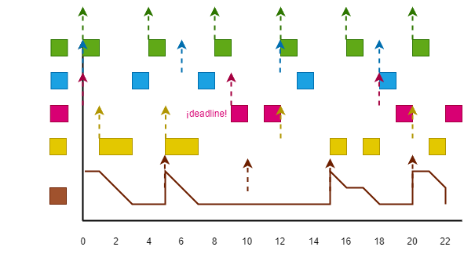

***Dado el sistema con el siguiente conjunto de tareas:***

Tareas Periódicas
| | Ci | Ti |
| :-: | :-: | :-: |
| τ1 | 1 | 4 |
| τ2 | 1 | 6 |
| τ3 | 2 | 9 |

Tareas Aperiódicas
| | ri | Ci |
| :-: | :-: | :-: |
| a1 | 1 | 2 |
| a2 | 8 | 1 |
| a3 | 12 | 2 |
| a3 | 20 | 1 |

Nota: r denota el instante de llegada de la petición aperiódica.

---

### **EJERCICIO 1**

***Utilizando una planificación background,***

***a\) Indica el tiempo de respuesta para las actividades aperiódicas.***

Ra1 = 7, Ra2 = 4, Ra3 = 4, Ra4= 3.

***b\) ¿La ejecución de las tareas aperiódicas hace que incrementen los tiempos de respuesta de las tareas periódicas? ¿Por qué?***

No, en la planificación background la ejecución de las tareas aperiódicas no afecta a la ejecución de las tareas periódicas.

***c\) ¿Qué habría que hacer con el conjunto de tareas periódicas para mejorar los tiempos de respuesta de las tareas aperiódicas?***

Se podría mejorar el tiempo de respuesta de las tareas aperiódicas modificando las tareas periódicas, ya sea teniendo menos, reduciendo sus tiempos de ejecución, o aumentando el tiempo de sus periodos. Si no, para mejorar los tiempos de respuesta medios de tareas aperiódicas, se usa un servidor.

---

### **EJERCICIO 2**

***Utilizando un servidor por consulta con Ts = 5 y Cs  = 2,***

***a\) Indica el tiempo de respuesta para las actividades aperiódicas.***

Ra1 = 2, Ra2 = 3, Ra3 = 6, Ra4 = 2.

***b\) Calcula la máxima utilización del procesador que puede ser asignada al servidor por consulta de forma que garantice la planificabilidad de las tareas periódicas.***

$$ U_s + U_p \leq U_{lub}(n+1) \longrightarrow U_s + \sum_{i=1}^N \frac{C_i}{D_i} \leq \left( N+1 \right) \left( 2^{\frac{1}{N+1}} - 1 \right) = L_U(N+1) $$

Us + (1/4 + 1/6 + 2/9) <= (3+1)*(2^(1/(3+1))-1) = L(3+1) -> Us + 0.638 <= 0.756 -> max Us = 0.118.

***c\) Según el valor calculado en el apartado anterior, ¿se puede afirmar que este servidor garantiza la planificabilidad de las tareas periódicas?***

¿Cs/Ts = 2/5 = 0.4 <= Us = 0.118?

Test falla, no podemos asegurar que el sistema sea planificable.

***d\) ¿Cómo afectaría a la planificabilidad de las tareas periódicas si la tarea aperiódica a2 tuviese los parámetros r2 = 5 y c2 = 2? Justifica tu respuesta.***

Como se ha comentado en el apartado anterior, no podemos asegurar que con ese servidor el sistema sea planificable. Con estos nuevos datos, se demuestra como ahora no se puede planificar, habiendo un deadline en el instante 9 con la tarea τ3.

---

### **EJERCICIO 3**

***Utilizando un servidor diferido con Ts = 5 y Cs  = 2,***

***a\) Indica el tiempo de respuesta para las actividades aperiódicas.***

Ra1 = 2, Ra2 = 2, Ra3 = 3, Ra4 = 2.

***b\)  Calcula la máxima utilización del procesador que puede ser asignada al servidor diferido de forma que garantice la planificabilidad de las tareas periódicas.***

$$ U_p = \sum_{i=1}^N \frac{C_i}{D_i} \leq \ln\left(\frac{U_s + 2}{2U_s + 1}\right) $$

(1/4 + 1/6 + 2/9) <= ln((Us + 2) / (2Us + 1)) -> Us = 0.0378.

---

### **EJERCICIO 4**

***Utilizando un servidor esporádico con Ts = 5 y Cs = 2,***

***a\) Indica el tiempo de respuesta para las actividades aperiódicas.***

Ra1 = 2, Ra2 = 2, Ra3 = 3, Ra4 = 2.

***b\) Calcula la máxima utilización del procesador que puede ser asignada al servidor esporádico de forma que garantice la planificabilidad de las tareas periódicas.***

$$ U_p = \sum_{i=1}^N \frac{C_i}{D_i} \leq \ln\left(\frac{2}{U_s + 1}\right) $$

(1/4 + 1/6 + 2/9) <= ln(2 / (Us + 1)) -> Us = 0.055.