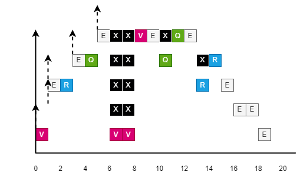
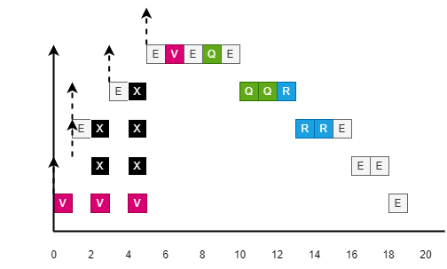
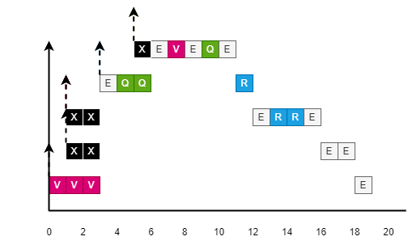
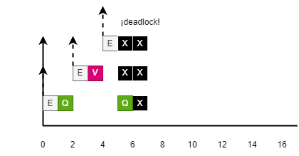
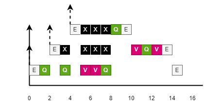
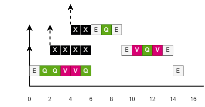

### **EJERCICIO 1**

***Dado un sistema formado por 5 tareas (τ1, τ2, τ3, τ4, τ5) y 3 recursos compartidos (R, Q y V) con las siguientes características:***
| | Pi | ri | Secuencia Ejecución i |
| :-: | :-: | :-: | :- |
| τ1 | 5 | 5 | EVEQE
| τ2 | 4 | 3 | EQQR
| τ3 | 3 | 1 | ERRE
| τ4 | 2 | 1 | EE
| τ5 | 1 | 0 | VVVE

***La siguiente tabla muestra el convenio que se puede utilizar para mostrar en el cronograma los estados en los que puede estar una tarea en cada instante:***
|||
| :-: | :- |
| E | En ejecución |
| Q | En ejecución bloqueando el recurso Q |
| R | En ejecución bloqueando el recurso R |
| V | En ejecución bloqueando el recurso V |
|  | En espera (la casilla se deja en blanco) |
| X | Bloqueado |

***Asumiendo una única activación de cada una de las tareas,***

***a\) Dibujar el correspondiente cronograma utilizando cada uno de los siguientes protocolos: herencia de prioridades, techo de prioridad original (OCPP) y techo de prioridad inmediato (ICPP).***

Por herencia de prioridades:

Por techo de prioridad original (OCPP):

Por techo de prioridad inmediato (ICPP):

***b\) Observando los cronogramas realizados en el apartado anterior, indica qué tareas sufren bloqueos encadenados.***

Los protocolos de techo de prioridad (OCPP e ICPP) previenen los bloqueos encadenados.
El cronograma del protocolo por herencia de prioridades tiene bloqueos encadenados en τ1 (instantes 6-8 y 10) y en τ2 (instante 13).

***c\) Observando los cronogramas anteriores, indica la diferencia que existe entre OCPP e ICPP en cuanto a en qué instantes una tarea puede sufrir un bloqueo.***

- El protocolo OCPP puede sufrir bloqueos al solicitar el primer recurso.
- El protocolo ICPP puede sufrir bloqueos al inicio de su activación.

---

### **EJERCICIO 2**

***Dado un sistema formado por 3 tareas (τ1, τ2, τ3) y dos recursos compartidos (V y Q) con las siguientes características:***
| | Pi | ri | Secuencia Ejecución i |
| :-: | :-: | :-: | :- |
| τ1 | 3 | 4 | EQE
| τ2 | 2 | 2 | EVQVE
| τ3 | 1 | 0 | EQQVVQE

***Teniendo en cuenta el acceso anidado a los recursos y asumiendo una única activación de cada una de las tareas, dibujar el correspondiente cronograma utilizando los siguientes protocolos: herencia de prioridades, techo de prioridad original (OCPP) y techo de prioridad inmediato (ICPP).***

Por herencia de prioridades:

Se produce deadlock porque τ3 debería acceder al recurso V que está siendo bloqueado por τ2 que tiene menos prioridad.

Por techo de prioridad original (OCPP):

Por techo de prioridad inmediato (ICPP):

---

### **EJERCICIO 3**

***Dado el sistema de tareas y recursos compartidos expuesto en el ejercicio 1:***

***a\) Calcula la duración máxima de bloqueo para cada tarea utilizando el protocolo de herencia de prioridades.***

$$
B_i = \sum_{k=1}^{K} \text{utilización}(k, i) \cdot C(k) \\
utilización(k, i) =
  \begin{cases}
  1 & \text{si } \exists j : P_j < P_i \text{ y } \exists x : P_x \geq P_i \text{; j,x usan recurso k.} \\
  0 & \text{en otro caso.}
  \end{cases}
$$

Bτx = Q + R + V \
Bτ1 = 2 + 0 + 3 = 5 \
Bτ2 = 0 + 2 + 3 = 5 \
Bτ3 = 0 + 0 + 3 = 3 \
Bτ4 = 0 + 0 + 3 = 3 \
Bτ5 = 0 + 0 + 0 = 0

***b\) Calcula la duración máxima de bloqueo para cada tarea utilizando los protocolos de techo de prioridad.***

$$
B_i = \max_{k=1}^{K} \text{utilización}(k, i) \cdot C(k) \\
utilización(k, i) =
  \begin{cases}
  1 & \text{si } \exists j : P_j < P_i \text{ y } \exists x : P_x \geq P_i \text{; j,x usan recurso k.} \\
  0 & \text{en otro caso.}
  \end{cases}
$$

Bτx = max(Q, R, V) \
Bτ1 = max(2, 0, 3) = 3 \
Bτ2 = max(0, 2, 3) = 3 \
Bτ3 = max(0, 0, 3) = 3 \
Bτ4 = max(0, 0, 3) = 3 \
Bτ5 = max(0, 0, 0) = 0